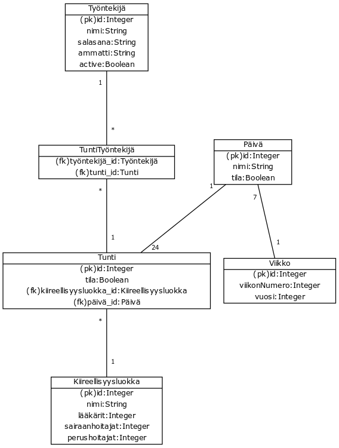
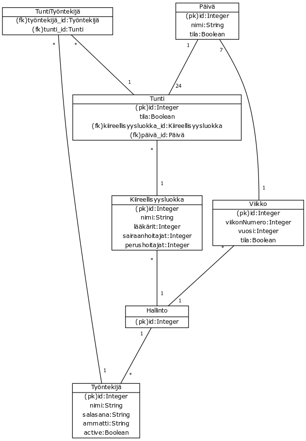

## Tietokanta hahmotelma

Hahmotelmassa yksi liitostaulu TuntiTyöntekijä joka liittää työntekijän yhteen tuntiin.
Tunnilla ja päivällä on muuttuja tila joka täytyy kaikissa olla True jotta viikon voi lukita ja julkaista työntekijöille.
Jokaiseen tuntiin kuuluu myös kiireellisyysluokka, eli määrä kutakin ammattilaista joka täytyy joko täsmätä tai ylittää jotta tunti olisi hyväksytyssä tilassa.
Hallinto näkee kaikki hyväksytyt viikot

#### (Uusin) tässä hahmotelmassa yhdistin hallinnon ja työntekiän. sovelluksessa tällä hetkellä viikko kuuluu työntekiälle mutta myöhemmin tämän korvaa TuntiTyöntekiä

#### (Vanha)
